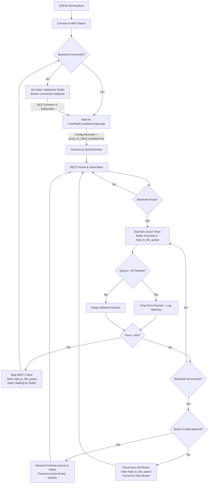

# Optional MQTT Broker Gateway / Proxy Feature

## 1. Overview & Objectives

This document details the architectural plan, feasibility analysis, protocol details, and implementation tasks for adding an **optional MQTT Gateway / Proxy** feature to the `meshtastic-esp32-bt-bridge`.

### Goals
* **Completely Optional:** The feature is disabled by default. If disabled, existing TCP bridging operation is 100% unaffected.
* **Auto-Sync from Radio (Zero-Config):** Automatically inherits broker address, port, credentials, encryption (TLS), and root topic directly from the connected Meshtastic radio's `ModuleConfig.mqtt` payload. Eliminates configuration duplication and prevents topic mismatch bugs.
* **3-Tier TLS Security Architecture:**
  * **Tier 1 (Public CA):** Built-in Mozilla Root CA bundle for zero-config public brokers (`mqtt.meshtastic.org`, AWS IoT, HiveMQ, etc.).
  * **Tier 2 (Custom / Private CA):** Upload / paste custom CA root certificates in PEM format for private/enterprise brokers.
  * **Tier 3 (Insecure Bypass):** Toggle to skip certificate and hostname validation for quick LAN/self-signed testing.
* **Autonomous 24/7 Gateway:** When enabled, the ESP32 acts as an autonomous MQTT client proxy for the connected Meshtastic radio (which has `module_config.mqtt.proxy_to_client_enabled = true`), eliminating the need to keep a mobile phone or desktop computer running continuously.
* **Safe Coexistence with TCP Clients:** Simultaneous TCP clients (such as the Meshtastic Web UI, desktop apps, or mobile apps connecting via WiFi) can coexist with the bridge without corrupting the BLE link or causing duplicate MQTT publishes.

---

## 2. Technical Feasibility & Impact Analysis

### 2.1 Feasibility on ESP32 / ESP32-S3
* **Verdict:** 100% Feasible.
* **CPU:** The ESP32 / ESP32-S3 dual-core Xtensa CPU (240 MHz) provides ample compute:
  * Core 0 handles WiFi networking (AsyncTCP, AsyncWebServer, and the MQTT client).
  * Core 1 handles the NimBLE stack and BLE polling.
* **Flash Space:** Our `huge_app.csv` partition table allocates ~3.1 MB for firmware. The current binary is ~1.3 MB (including embedded root CA bundle), providing ~1.8 MB of headroom.

### 2.2 Performance & CPU Impact
* **Negligible CPU Overhead (< 1-2%):** Meshtastic is designed for low-bandwidth LoRa links (typically 0.1 to 5 packets/second). An MQTT client processing a handful of small JSON/Protobuf packets per minute places virtually zero strain on the CPU.
* **Low Latency:** BLE packet reception to MQTT publish is sub-10ms over local WiFi. MQTT downlink to BLE `ToRadio` transmission is equally fast.

### 2.3 Memory Footprint & Safety
* **Plain MQTT (Port 1883):** Requires ~4–6 KB of RAM for socket buffers, state machines, and queues.
* **Secure MQTT / MQTTS (Port 8883 / TLS):** Requires mbedTLS (`WiFiClientSecure`). The TLS 1.2/1.3 handshake and cipher buffers require ~30–40 KB of heap during active connections.
* **Heap Margin:** The ESP32 currently has >150 KB free internal SRAM (and S3 models often have 2MB–8MB PSRAM). Even without PSRAM, a 35 KB TLS allocation leaves >110 KB of safety margin.
* **Heap Fragmentation Immunity:** We maintain the project's zero-fragmentation rule by keeping MQTT packet buffers statically or stack-allocated and reusing queues.

---

## 3. Configuration Architecture: Radio Auto-Sync

### 3.1 Why Auto-Sync is the Native Architecture
In the Meshtastic ecosystem, the **physical radio** is the authoritative source of truth for MQTT topics, encryption keys, and channel hashes. When the radio formats a `MqttClientProxyMessage`, the topic string (e.g. `msh/US/2/e/...` or `ptp/commons/...`) is constructed internally based on its own `ModuleConfig.mqtt.root` configuration.

By using Auto-Sync:
1. **Zero Configuration Drift:** The user configures MQTT once inside the standard Meshtastic App / CLI. The bridge automatically adapts.
2. **No Topic Rewriting Complexity:** Avoids error-prone dynamic prefix rewriting across complex mesh channels.
3. **Identical to Official Mobile Apps:** The bridge operates identically to the official Android/iOS apps when proxying.

### 3.2 Radio MQTT Settings
When a user configures MQTT via the official Meshtastic mobile or desktop apps, the settings are stored on the radio inside `ModuleConfig.mqtt`:
* **`address`**: Hostname or IP of the broker (e.g. `mqtt.meshtastic.org`).
* **`username`** & **`password`**: Broker credentials.
* **`encryption_enabled`** (`bool`): Whether TLS/SSL (port 8883) is required.
* **`root`**: Root topic prefix (e.g. `msh` or custom).
* **`proxy_to_client_enabled`** (`bool`): Tells the radio to offload MQTT to the connected client.

During the initial BLE connection sync, the radio transmits its configuration to the bridge via `FromRadio.config` / `FromRadio.moduleConfig`.

---

## 4. How Meshtastic Mobile Apps & Clients Relate to MQTT Proxy

### 4.1 Mobile App Behavior (Android & iOS)
* Both the **official Android app** and **iOS app** support MQTT Proxy using the exact same `ModuleConfig.mqtt` mechanism:
  * When a mobile device connects to a radio that has `proxy_to_client_enabled = true`, the mobile app reads the radio's `ModuleConfig.mqtt`, establishes an internet connection on the phone to the broker, and relays `MqttClientProxyMessage` packets over cellular or WiFi.

### 4.2 Why Bridge MQTT Proxy is a Major Upgrade
* **24/7 Availability:** Mobile apps are subject to operating system background execution limits, battery saver kills, network switching (WiFi $\leftrightarrow$ LTE), and leaving the radio's physical range.
* **Dedicated Appliance:** An ESP32 plugged into power on the home/office network maintains a permanent, uninterrupted uplink/downlink to the MQTT broker for the mesh.

### 4.3 Concurrency & Conflict Analysis

```text
                                 ┌─────────────────────────────────┐
                                 │   Meshtastic BLE Radio Node     │
                                 │ (proxy_to_client_enabled = true)│
                                 └───────────────┬─────────────────┘
                                                 │ BLE (ToRadio / FromRadio)
                                                 ▼
               ┌─────────────────────────────────────────────────────────────────┐
               │                     ESP32-S3 Bridge Device                      │
               │                                                                 │
               │   ┌─────────────────────┐             ┌─────────────────────┐   │
               │   │    BLE Task         │             │   MQTT Client Task  │   │
               │   │  (Core 1 - NimBLE)  │             │   (Core 0 - WiFi)   │   │
               │   └──────────┬──────────┘             └──────────┬──────────┘   │
               │              │                                   │              │
               │              │ FreeRTOS Queue                    │              │
               │              ▼                                   │              │
               │   ┌─────────────────────┐                        │              │
               │   │ TCP Server (4403)   │                        │              │
               │   │  (Core 0 - Async)   │                        │              │
               │   └──────────┬──────────┘                        │              │
               └──────────────┼───────────────────────────────────┼──────────────┘
                              │ TCP Port 4403                     │ MQTT (1883/8883)
                              ▼                                   ▼
                   ┌─────────────────────┐             ┌─────────────────────┐
                   │ Meshtastic App / UI │             │     MQTT Broker     │
                   │ (Monitor / Config)  │             │ (e.g. meshtastic.org│
                   │                     │             │  or private broker) │
                   └─────────────────────┘             └─────────────────────┘
```

#### Potential Conflicts and Resolutions:
1. **Normal TCP Client (Web UI / Phone App / Meshtastic CLI) + Bridge MQTT:**
   * **Behavior:** The TCP client sends commands and receives standard mesh packets (text messages, node DB, telemetry).
   * **BLE Arbitration:** Both TCP and MQTT transmit to the radio via a shared FreeRTOS queue (`tcp_to_ble_queue`), ensuring thread-safe, sequential writes to the `ToRadio` BLE characteristic.
   * **Result:** Seamless coexistence.

2. **External TCP Client ALSO running an MQTT Proxy (e.g., MeshMonitor with proxy enabled):**
   * **Risk:** If both the ESP32 Bridge and MeshMonitor connect to the broker and publish the same `FromRadio.mqttClientProxyMessage`, duplicate messages will hit the MQTT server.
   * **Resolution:**
     * **Packet Filtering:** When the ESP32 Bridge's MQTT client is enabled, the bridge intercepts and consumes `FromRadio.mqttClientProxyMessage` packets so they are published to MQTT directly and *not* duplicated onto the TCP client stream.
     * **UI / User Guidance:** The WebUI and documentation instruct users to disable the proxy toggle in upstream TCP clients (like MeshMonitor) when the bridge's native MQTT feature is enabled.

### 4.4 Packet Routing & Filtering Reference

The bridge routes and filters packets across BLE, TCP, and MQTT according to the following rules:

#### Packets Coming FROM the Bluetooth Radio (BLE ➔ Bridge)
| Packet Type | Purpose | Bridge Action | Forwarded to TCP Phone Apps? |
| :--- | :--- | :--- | :--- |
| **`MqttClientProxyMessage`** | Uplink mesh data destined for MQTT | Published directly to MQTT broker by the bridge. | ❌ **No (Filtered / Consumed)** — Prevents phone apps from duplicating uploads. |
| **`ModuleConfig.mqtt`** | Radio's MQTT broker configuration | Bridge snoops settings to auto-connect to broker. | ✅ **Yes** — Forwarded so phone apps can read their radio settings. |
| **Standard Mesh Packets** | Messages, GPS, NodeDB, Telemetry, Channels | Encapsulated in standard `0x94 0xC3` TCP framing. | ✅ **Yes** — Broadcast to all connected TCP apps. |

#### Packets Going TO the Bluetooth Radio (➔ BLE Radio)
| Source | Direction | Bridge Action | Sent to Radio? |
| :--- | :--- | :--- | :--- |
| **TCP Phone App** | Phone App ➔ Radio | Strips `0x94 0xC3` framing and writes directly to `ToRadio` characteristic (high priority). | ✅ **Yes** |
| **MQTT Broker** | Internet MQTT ➔ Radio | Wraps incoming downlink payload into a `ToRadio` envelope and writes to `ToRadio`. | ✅ **Yes** |

### 4.5 Dual-Queue Architecture & Command Prioritization

To prevent high-volume MQTT mesh traffic from blocking interactive phone app commands (such as changing channel settings or sending direct messages), the bridge maintains two separate, statically allocated FreeRTOS queues:

```text
┌─────────────────────────┐
│ TCP Client (Phone App)  │ ──► [ tcp_to_ble_queue (Size: 100) ] ──┐ (Priority 1: High)
└─────────────────────────┘                                        │
                                                                   ▼
                                                           ┌────────────────┐
                                                           │  bridgeBleTask │ ──► BLE ToRadio
                                                           └────────────────┘
                                                                   ▲
┌─────────────────────────┐                                        │
│ MQTT Broker Downlink    │ ──► [ mqtt_to_ble_queue (Size: 40) ] ──┘ (Priority 2: Normal)
└─────────────────────────┘
```

1. **`tcp_to_ble_queue` (High Priority):** Carries locally generated phone app commands and chat packets. `bridgeBleTask` always checks and drains this queue first.
2. **`mqtt_to_ble_queue` (Normal Priority):** Carries incoming remote mesh packets received from the MQTT broker. Polled only when the TCP command queue is empty.
3. **Static Allocation (.bss segment):** All packet queues are statically reserved with zero dynamic `malloc` overhead:
   * **ESP32-S3:** `BRIDGE_QUEUE_SIZE = 100` (58.4 KB each), `MQTT_QUEUE_SIZE = 40` (23.4 KB) — total ~140 KB `.bss` queue RAM.
   * **ESP32 Classic (`esp32dev`):** `BRIDGE_QUEUE_SIZE = 32` (18.7 KB each), `MQTT_QUEUE_SIZE = 16` (9.3 KB) — total ~46.7 KB `.bss` queue RAM, preserving ~50 KB+ of runtime free heap for TLS and networking.

### 4.6 Connection Lifecycle & Disconnect Grace Period Model



#### Detailed Lifecycle & State Transition Rules:
1. **Bluetooth-Gated Broker Startup:**
   * On initial boot, the bridge waits for the Bluetooth link to establish and for `FromRadio.moduleConfig.mqtt` to arrive (`bridge_is_ble_connected() == true`).
   * The MQTT client starts only if `proxy_to_client_enabled == true` on the radio.
2. **Bluetooth Disconnect Grace Period (Default: 60 Seconds):**
   * If Bluetooth drops, the bridge starts a 60-second grace timer (`MQTT_BLE_GRACE_PERIOD_SECONDS`).
   * The MQTT broker TCP/TLS socket **remains open**, allowing up to 40 incoming downlink packets to buffer in `mqtt_to_ble_queue`.
   * **Queue Saturation:** If 40 packets accumulate before BLE reconnects, subsequent packets are dropped with a warning log.
3. **Grace Timer Expiry (> 60 Seconds):**
   * If BLE remains disconnected past 60 seconds, the MQTT client is stopped (`mqtt_net_stop_client()`), `mqtt_to_ble_queue` is cleared via `xQueueReset()`, and state switches to `MQTT_STATE_WAITING_RADIO_CONFIG`.
4. **Fast Reconnect & Config Change Detection:**
   * If BLE reconnects within 60 seconds:
     * **Identical Configuration:** The bridge compares the incoming radio settings with the active session struct. If identical, the existing MQTT session is kept and `bridgeBleTask` immediately resumes draining `mqtt_to_ble_queue` to the radio.
     * **Changed Configuration (e.g. Swapped Radio):** The old MQTT client is stopped, `mqtt_to_ble_queue` is cleared, and a new client is spawned for the new broker.
5. **AP / Setup Mode Isolation:**
   * In AP / Setup mode (`wifi_net_is_ap_mode() == true`), settings are saved strictly to NVS without spawning background network clients.

---

## 5. Configuration & WebUI Specification

### 5.1 Settings to Store in NVS (`bridge_cfg` namespace)

| Key | Type | Default | Description |
| :--- | :--- | :--- | :--- |
| `mqtt_enabled` | bool | `false` | Master toggle to enable/disable MQTT gateway on the bridge |
| `mqtt_tls_insec` | bool | `false` | Skip certificate & hostname validation (for local self-signed brokers) |
| `mqtt_custom_ca` | string | `""` | Optional PEM-encoded Root CA / Server Certificate for private brokers |

### 5.2 Compile-Time Build Options (`build_options.h`)

| Build Flag | Default | Description |
| :--- | :--- | :--- |
| `BRIDGE_QUEUE_SIZE` | `100` (S3) / `32` (Classic) | Statically allocated packet capacity for TCP <-> BLE message queues |
| `MQTT_QUEUE_SIZE` | `40` (S3) / `16` (Classic) | Statically allocated packet buffer capacity for MQTT downlink messages |
| `MQTT_BLE_GRACE_PERIOD_SECONDS` | `60` | Duration to keep MQTT broker alive during transient Bluetooth disconnects |

### 5.3 WebUI Design & Components
A dedicated **MQTT Gateway (Auto-Sync from Radio)** card added to the captive portal:
* **Toggle Switch:** "Enable MQTT Gateway" (master toggle).
* **Live Radio Sync Information Panel:**
  * *Radio Proxy Enabled:* `Yes` / `No`
  * *Detected Broker:* `mqtt.meshtastic.org:8883 (TLS)`
  * *Username:* `meshdev`
  * *Root Topic:* `msh/US`
* **TLS & Security Overrides (Bridge-Specific):**
  * *Skip Certificate Validation Checkbox:* Bypasses trust chain check for self-signed or local IP brokers.
  * *Custom CA Certificate (PEM Text Area):* Allows uploading / pasting custom root CA public certificates for secure private TLS.
* **Connection Status Pill:** Live indicator showing `Disabled`, `Waiting for Radio Config...`, `Connecting...`, `Connected (Broker: ...)` or `Connection Failed`.
* **Actions:**
  * "Save MQTT Configuration"

---

## 6. Protobuf Protocol Details

### 6.1 Protobuf Envelope Structures
Meshtastic defines proxy and configuration structures in `mesh.proto` and `module_config.proto`:

```protobuf
// Outbound from Radio to Client / Bridge
message FromRadio {
  // ...
  MqttClientProxyMessage mqttClientProxyMessage = 14;
}

// Inbound from Client / Bridge to Radio
message ToRadio {
  // ...
  MqttClientProxyMessage mqtt_client_proxy_message = 6;
}

// MQTT Proxy Packet
message MqttClientProxyMessage {
  string topic = 1;
  oneof payload_variant {
    bytes data = 2;   // Serialized ServiceEnvelope (binary)
    string text = 3;  // Plaintext / JSON string
  }
  bool retained = 4;
}

// MQTT Module Configuration on Radio
message MQTTConfig {
  bool enabled = 1;
  string address = 2;
  string username = 3;
  string password = 4;
  bool encryption_enabled = 5;
  bool json_enabled = 6;
  bool tls_enabled = 7;
  string root = 8;
  bool proxy_to_client_enabled = 9;
  // ...
}
```

### 6.2 Routing & Auto-Sync Logic
1. **Config Discovery (Auto Mode):**
   * Listen for incoming configuration packets (`FromRadio` containing `MQTTConfig` or `AdminMessage`).
   * Extract `address`, `username`, `password`, `encryption_enabled`/`tls_enabled`, and `root`.
   * Initialize or update the MQTT client connection parameters dynamically.
2. **Uplink (Radio $\to$ MQTT):**
   * Read packet from `FromRadio`.
   * Decode protobuf. If field 14 is present:
     * Extract `topic`, `payload`, and `retained`.
     * Publish to MQTT broker: `mqttClient.publish(topic, payload, len, retained)`.
     * If Bridge MQTT is enabled, suppress forwarding this specific packet to TCP clients to avoid duplicate external proxying.
3. **Downlink (MQTT $\to$ Radio):**
   * MQTT client receives message on subscribed topic.
   * Encode `ToRadio` message setting field 6 (`mqtt_client_proxy_message`).
   * Push encoded bytes into `to_ble_queue`.
   * BLE task writes to `ToRadio` GATT characteristic.

---

## 7. Dependency & Submodule Management Strategy

### 7.1 Decision: Git Submodule (`meshtastic/protobufs`)
Rather than copying external source files into `src/` or depending on downstream third-party Arduino libraries, we integrate the official **`meshtastic/protobufs`** repository directly as a Git Submodule.

* **Repository:** `https://github.com/meshtastic/protobufs.git`
* **Submodule Path:** `proto/meshtastic`
* **Target Version / Tag:** `v2.7.26` (Latest mature stable release track)

### 7.2 Why This Approach Was Chosen
1. **Canonical Source of Truth:** `meshtastic/protobufs` is the authoritative definition repo maintained by the Meshtastic core team.
2. **Zero Repository Bloat:** No generated `.pb.h` or `.pb.c` files are committed into the project repository.
3. **Selective Compilation:** Only the required proto definitions (`mesh.proto`, `mqtt.proto`, `module_config.proto`, `config.proto`, `portnums.proto`, `telemetry.proto`) are generated during the build.
4. **Deterministic & Reproducible Builds:** Pinning to tag `v2.7.26` guarantees that upstream commits will never break builds unexpectedly.
5. **Linker Dead-Code Elimination:** GCC/Clang with `-Wl,--gc-sections` automatically discards all unused structs and descriptors at link time, resulting in **0 bytes of RAM/Flash overhead** for unused modules.

### 7.3 Submodule Maintenance & Upgrade Procedure
* **Initial Clone / Checkout:**
  ```bash
  git submodule update --init --recursive
  ```
* **Upgrading to a Newer Meshtastic Release (e.g. `v2.8.x`):**
  ```bash
  cd proto/meshtastic
  git fetch --tags
  git checkout v2.8.x
  cd ../..
  git add proto/meshtastic
  git commit -m "Upgrade Meshtastic protobufs to v2.8.x"
  ```

### 7.5 TLS Architecture & Root CA Bundle Pipeline
To support verified TLS connections to public MQTT brokers (such as `mqtt.meshtastic.org:8883` backed by Let's Encrypt, or AWS IoT, HiveMQ, EMQX) without hardcoding single static certificates, the build pipeline embeds the standard Mozilla Root CA bundle:

1. **Embedded Bundle (`data/cert/x509_crt_bundle.bin`):** Pre-compiled binary representation containing ~130+ public root CAs (~86 KB).
2. **Linker Integration:** Configured in `platformio.ini` via `board_build.embed_files = data/cert/x509_crt_bundle.bin`. The start symbol `_binary_data_cert_x509_crt_bundle_bin_start` is linked directly into flash.
3. **Runtime Registration:** `mqtt_net_init()` registers the bundle in flash via `arduino_esp_crt_bundle_set(rootca_crt_bundle_start)`.
4. **Dual Verification Pipeline:**
   * **Standard TLS (`tls_insecure = false`):** `mqtt_cfg.crt_bundle_attach = arduino_esp_crt_bundle_attach;` attaches the bundle for binary-search verification during the TLS handshake.
   * **Insecure / Self-Signed TLS (`tls_insecure = true`):** Attaches a custom callback executing `mbedtls_ssl_conf_authmode(ssl_conf, MBEDTLS_SSL_VERIFY_NONE)` and sets `skip_cert_common_name_check = true` to bypass verification for local/private brokers with self-signed certificates.

---

## 8. Implementation Roadmap & Task Tracker

### Phase 1: Planning & Research ✅
- [x] Analyze ESP32-S3 feasibility, CPU, memory, and flash constraints.
- [x] Investigate Meshtastic `MqttClientProxyMessage` and `MQTTConfig` protobuf specifications.
- [x] Evaluate Auto-Sync from Radio vs. Manual WebUI configuration modes.
- [x] Evaluate concurrency and collision prevention between TCP clients and MQTT proxy.
- [x] Evaluate and document Git Submodule dependency management strategy (`v2.7.26`).
- [x] Document architecture and design in `docs/feature-mqtt-proxy.md`.

### Phase 2: Protobuf & Dependency Integration ✅
- [x] Add `nanopb/Nanopb @ ^0.4.7` to `platformio.ini`.
- [x] Add `meshtastic/protobufs` Git submodule pinned to `v2.7.26` in `proto/meshtastic`.
- [x] Implement `generate_protos.py` PlatformIO pre-script to compile needed protos dynamically into build directory.
- [x] Embed standard Mozilla Root CA bundle (`data/cert/x509_crt_bundle.bin`) via `board_build.embed_files`.
- [x] Verify clean build on `seeed_xiao_esp32s3`, `esp32dev`, and `esp32-s3-devkitc-1`.

### Phase 3: MQTT Client Subsystem (`mqtt_net`) ✅
- [x] Create `include/mqtt_net.h` and `src/mqtt_net.cpp`.
- [x] Implement broker connection, reconnection backoff, keep-alive loop, and TLS support using ESP-IDF `mqtt_client`.
- [x] Implement Mozilla Root CA bundle verification and self-signed `MBEDTLS_SSL_VERIFY_NONE` insecure bypass.
- [x] Implement topic subscription matching (`<root>/#` or custom channels).
- [x] Implement message publishing from `MqttClientProxyMessage` payloads.
- [x] Implement radio `MQTTConfig` parser for Auto-Sync mode.
- [x] Implement self-locking recursive mutex thread synchronization (`MqttLockGuard`).

### Phase 4: WebUI & Storage Integration ✅
- [x] Add MQTT preferences keys to `include/config_ui.h` and `src/config_ui.cpp`.
- [x] Add the "MQTT Gateway" UI card with mode toggle (Auto-Sync vs. Manual), inputs, and live radio status.
- [x] Implement REST endpoints `/save_mqtt` and `/mqtt_status`.
- [x] Add client-side validation and live status polling in WebUI.
- [x] Ensure AP/Setup mode only persists settings to NVS without launching runtime client until Normal boot.

### Phase 5: Bridge Pipeline Multiplexing ✅
- [x] Update `bridge.cpp` to inspect incoming `FromRadio` packets for field 14 (`MqttClientProxyMessage`) and config packets.
- [x] Route `MqttClientProxyMessage` packets to `mqtt_net` for publishing.
- [x] Route downlink MQTT packets from `mqtt_net` into `tcp_to_ble_queue`.
- [x] Add packet filtering to prevent echoing proxy packets to TCP clients.
- [x] Gate initial MQTT broker connection on active Bluetooth connection (`bridge_is_ble_connected()`), while preserving MQTT broker connectivity across transient BLE drops.

### Phase 6: Verification & Testing 🔲
- [x] Multi-target compiler verification across `seeed_xiao_esp32s3`, `esp32dev`, and `esp32-s3-devkitc-1`.
- [ ] Hardware test: Auto-Sync mode with radio configured for public `mqtt.meshtastic.org:8883` (Mozilla Root CA verification).
- [ ] Hardware test: Custom broker with self-signed TLS (`mqtt_tls_insec = true`) and private Custom Root CA PEM verification.
- [ ] Hardware test: Simultaneous TCP client connection (Meshtastic App / Web UI) during active MQTT proxying (verify dual-queue arbitration and `MqttClientProxyMessage` filtering).
- [ ] Hardware test: Edge cases and transient failure recovery (MQTT broker outage recovery, BLE disconnect/reconnect within 60s grace period, 60s grace timer expiry, WiFi drop/reconnect).
- [ ] Hardware test: Queue saturation stress test (downlink traffic during BLE drop with >40 queued packets).

---

## 9. Phase 7: Future Improvements & Potential Enhancements

### 9.1 Configurable MQTT Proxy Passthrough to TCP Clients
* **Current Default Behavior:** When the MQTT Gateway is enabled, incoming `FromRadio` packets containing `MqttClientProxyMessage` (field 14) are published directly to the MQTT broker and consumed (stripped) so they are not forwarded to connected TCP clients (preventing duplicate publishes from connected phone apps).
* **Proposed Enhancement:** Add an optional configuration toggle in NVS (`mqtt_strip_proxy`, default `true`) and the WebUI:
  * **Setting Name:** *"Strip MQTT proxy messages to connected clients to prevent duplication"* (Toggle: `Yes` / `No`, Default: `Yes`).
  * **Option `Yes` (Default):** The bridge consumes `MqttClientProxyMessage` packets after publishing them to MQTT. TCP clients do not receive raw proxy envelopes.
  * **Option `No` (Passthrough Mode):** The bridge publishes to MQTT *and* forwards the raw `MqttClientProxyMessage` packets to all connected TCP clients.
  * **Use Cases for Passthrough (`No`):**
    * Diagnostic tools and raw packet sniffers connected over TCP.
    * External analytics/monitoring software requiring raw telemetry/proxy streams.
    * Multi-client proxy configurations where the TCP client explicitly manages deduplication.

### 9.2 Selective Downlink Topic Subscriptions
* Provide granular channel filtering options (e.g. subscribe only to primary channel `#` or specific downlink subtopics) to further reduce BLE queue bandwidth in congested mesh regions.
